# SQL Server on Linux and Containers Workshop

## Prelab setup for SQL Server on Linux Labs

This lab is required to setup your environment and tools to use the other labs. The workshop provides the necessary login and resources for:

- An Azure login so you provision an Azure Virtual Machine running Linux.
- A virtual machine running Windows 10 to install client tools and use them to interact with the Azure Virtual Machine and SQL Server.

The Resource tab on this lab page has login information for both Azure and the Windows 10 Virtual Machine.

The prelab is divided into four sections:

- Deploying an Azure Virtual Machine running Linux
- Installing tools on your client
- Connecting to the Linux VM with ssh
- Installing Updates and Docker for Linux

### Deploying an Azure Virtual Machine running Linux

For this first step in the prelab, you will learn how to deploy an Azure Virtual Machine running Red Hat Enterprise Linux. You will not install SQL Server during this prelab. You will do this in the first lab called **deploy_and_explore**.

1. Login into the Azure portal using the Resources tab. A new window will come up and prompt you to put in account information. If necessary choose "Use another account". Copy and paste the Username and Password when prompted for an eamil and password. You will placed into the Azure portal (Select Maybe later to skip the Azure Tour).

2. Click on **+ Create a resource**

3. Type in "Red Hat Enterprise Linux" in the Search Window and hit Enter. Your results should look something like this

    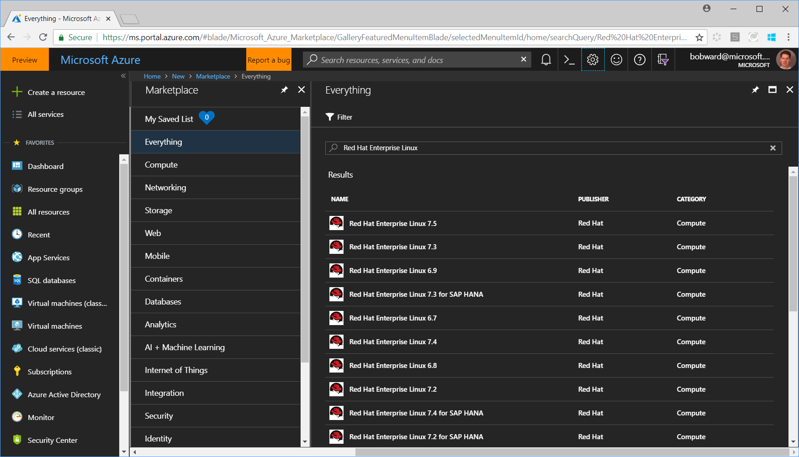

4. Select Red Hat Enterprise Linux 7.5 from the list

5. Click on the **Create** button at the bottom of the screen

6. Fill out the following fields on the Basics blade
    - Fill in the Name field with a unique hostname
    - Leave VM disk type set to SSD
    - Type in a Username
    - Choose Authentication Type of Password
    - Type in and Confirm a password that meets requirements. **IMPORTANT: This password will be used to login to the Linux VM. It is the root password which you will use with the sudo command in the labs. So secure and save this password.**
    - Leave AAD Disabled
    - Choose your Subscription
    - Use the existing resource group provided
    - Choose a location for your VM (The default is East US which should work fine for this lab)
    - Click on OK

        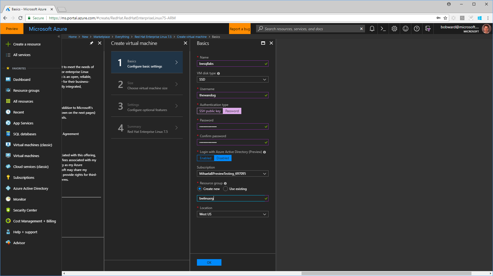

7. Choose a size for your VM
    - For purposes of these labs, we recommend a minimum of 4 vCPUs and 16GB RAM. I typically choose a DS13_V2 but you are free to pick any other VM with these minimum sizes (like a D8s_V3).
    - Click on **Select** when you have chosen your size.

8. Fill out the following fields on the Settings blade
    - Leave Availability zone set to None
    - Leave Managed Disks set to Yes
    - Leave all Network fields set to default
    - Leave Network Security Group set to Basic
    - Select SSH (22) for public inbound ports
    - Leave all other fields with default settings
    - Click OK

        

9. You will be presented with a new blade ready to create the VM. Click the **Create** button at the bottom of the blade

10. Your VM will now be deployed. You can click the Notifications icon at the top of the portal screen to see the deployment in progress. The typical time to create a virtual machine in Azure for Red Hat is about 5-10 minutes.

    

11. On the successful deployment screen, I recommend you select **Pin to Dashboard**

    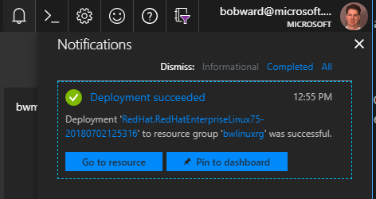

12. Now click on **Go to Resource** button and select X in the corner of this Notifications screen to remove it.

    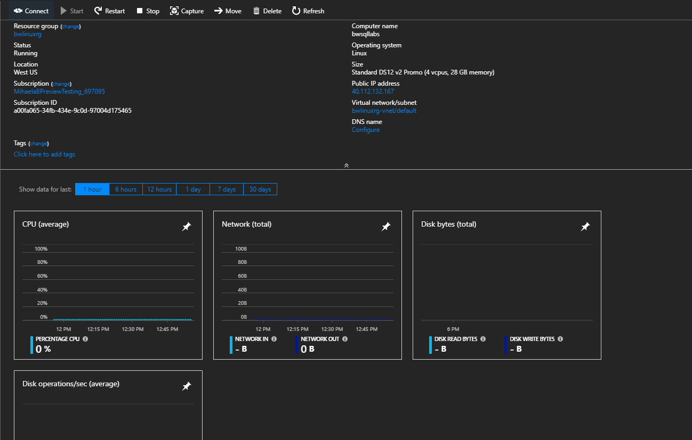

13. Configure a DNS name to make it easier to connect
    - On the resource page, click on **Configure** under **DNS name**
    - Type in a DNS name label. I typically just use the hostname when I created the VM
    - Click the Save button at the top of the screen. This should only take a few seconds
    - Click on the X to remove that screen

        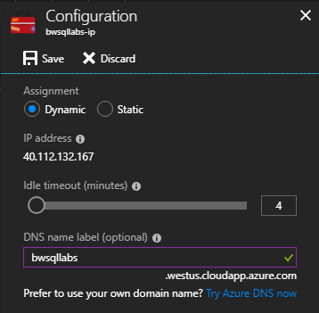

14. Your resources page should now show the DNS name you created (you may need to select Refresh).
1. 

15. Click on the **Connect** icon on the top of the resources page to capture how to connect to this VM with ssh

16. Under Login using VM local account click on the **Copy** icon to grab the connection syntax to connect to this VM with ssh. The information you need is everything after the word ssh. For example, for `ssh thewandog@bwsqllabs.westus.cloudapp.azure.com` you will just need `thewandog@bwsqllabs.westus.cloudapp.azure.com`. Save this information to use in the next section. I call this the **Linux Login**

    

### Installing tools on your client

**Note: The first step of this part of the lab is install software to be able to connect with ssh to your Linux Server. This lab instructs you how to use the popular tool MobaXterm. You are free to install and use any ssh client you like in the Windows 10 virtual machine.

Note: Do not click on the hyperlinks in these instructions. Use these links to install the client software in the Windows 10 virtual machine.

1. Login to the Windows 10 Virtual Machine. the Username and Password are in the Resources tabl. You can use click on the "T" to autofill the password on the Login screen for Windows 10. Once logged in, install the MobaXterm client application from <https://mobaxterm.mobatek.net/download-home-edition.html>

    - Choose the Installer Edition which in your browser will download a file called MobaXterm_Installer_v10.7.zip to your Downloads folder
    - Extract all the files from the zip file
    - Run the MobaXterm_installer_10.7.msi to launch the installer
    - Accept all the defaults to complete the installation

2. Install SQL Operations Studio from <https://docs.microsoft.com/sql/sql-operations-studio/download>

    - Choose the Installer Download from Windows.
    - Your browser will download the .exe file which is about 74Mb to your Downloads folder
    - Please make sure you are running at minimum the June 2018 Preview version of SQL Server Operations Studio. If you select the Help/About menu in the tool, your version should look something like the following

        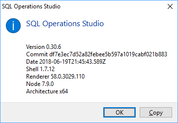

3. Install the latest SQL Server Management Studio (SSMS) from <https://docs.microsoft.com/sql/ssms/download-sql-server-management-studio-ssms>

Note: If you are pressed for time, installing SSMS is optional and can be skipped. There are labs to use SSMS to connect to SQL Server on Linux but they are not the core aspect to these labs.

    - If you have never installed SSMS before, choose the option "Download SQL Server Management Studio 17.X"
    - Please make sure you are running at minimum version 17.7
    - You can check your version by selecting the Help/About menu in the tool. Here is the following screenshot for Version 17.7

        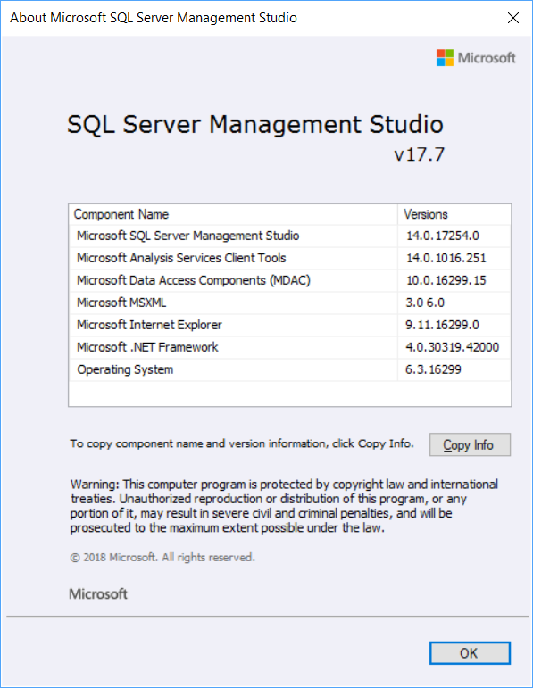

### Connecting to your Linux VM with ssh

`Note`: If you have any issues connecting with ssh to your Azure VM, be sure to have installed the latest version of your ssh client such as MobaXterm (<https://mobaxterm.mobatek.net/download.html>), Bitvise (<https://www.bitvise.com>), or whatever ssh client you are using on Windows.

You will need the **Linux Login** and the password you saved from the Azure VM Deployment section above in the prelab.

1. Launch the MobaXterm program
2. Click on the Session icon in the upper left hand portion of the application
3. Choose the SSH icon on the far left hand side of the new screen that appears
4. Put in the Remote Host field the **Linux Login** and click OK. The following screenshot shows an example

    

5. When prompted type in the password you used when deploying the Azure VM
6. You may get prompted to save the password. I recommend you click Yes
7. When you have connected successfully, your screen should look like the following

    

### Installing Updates and Docker for Linux

Note: Remove any previous installations of Docker from your RHEL image by executing the following command

`sudo yum remove docker docker-common docker-selinux docker-engine`

1. From your ssh prompt, update all existing packages and applications by running this command (enter the password you used to connect with ssh when prompted). This could take several minutes to update.

    `sudo yum -y update`

2 . Install docker engine by running the following:

```
sudo yum install -y yum-utils device-mapper-persistent-data lvm2

sudo yum-config-manager --add-repo https://download.docker.com/linux/centos/docker-ce.repo

sudo yum install http://mirror.centos.org/centos/7/extras/x86_64/Packages/pigz-2.3.3-1.el7.centos.x86_64.rpm

sudo yum install docker-ce
 ```

check status of docker engine:
```
sudo systemctl status docker
 ```

if is not running, start it by running:
``` 
sudo systemctl start docker
```
>Note: for this lab, we are installing docker for CentOS, this will work on CentOS or RHEL due to the similarity of the OS’s. For production usage on RHEL, install Docker EE for RHEL: https://docs.docker.com/install/linux/docker-ee/rhel/.
 
You are now ready to go through the first self-paced lab called **deploy_and_explore**.

You will run the rest of the instructions on using Docker containers for SQL Server in the **containers** lab.

### Clone the repo in the Linux VM

There are scripts that you will use in the labs on the Linux VM itself. One simple way for you to have access to the scripts to is clone the repo in the Linux VM

1. Install git if not already installed

    `sudo yum install git`

2. Use git to clone the repo

    `git clone https://github.com/Microsoft/sqllinuxlabs.git`

    You should know have a subdirectory in your home directory called **sqllinuxlabs**.

## Deploy and Explore SQL Server on Linux Lab

**STOP: This lab requires you have already followed the instructions in the prelab**

This lab will walk you through the basics of deploying SQL Server and command line tools on Linux using Red Hat Enterprise Linux (RHEL). Then you will go through a few exercises to get more familiar with Linux, connect to SQL Server on Linux with tools, and learn to use the mssql-conf script.

You should have already completed the prelab to setup RHEL in an Azure Virtual Machine and installed an ssh client, SQL Operations Studio, and SQL Server Management Studio (Windows clients only).

You can watch a demonstration of this lab on YouTube at <https://youtu.be/7vLBHzE7CuI>

### Deploy SQL Server on Linux

Run all of the following commands from your ssh session with the bash shell. This lab assumes your Linux Server is connected to the internet. You can do an offline installation of SQL Server on Linux. See the documentation at <https://docs.microsoft.com/sql/linux/sql-server-linux-setup#offline>

1. Copy the repository configuration file using the following command

    `sudo curl -o /etc/yum.repos.d/mssql-server.repo https://packages.microsoft.com/config/rhel/7/mssql-server-2017.repo`

    The repository configuration file is a text file that contains the location of the SQL Server package for RHEL. This repo file will point to the latest Cumulative Update for SQL Server 2017 on Linux. See our documentation for how to use a repository file for other branches <https://docs.microsoft.com/sql/linux/sql-server-linux-change-repo>

    With a good internet connection this should take a few seconds. The output will look something like the following

    

2. Use the yum package manager to kick off the installation with the following command (-y means don't prompt)

    `sudo yum install -y mssql-server`

    This will take longer as the package is around 170Mb. When this has successfully completed, your session should look like this

    

3. Now you must complete the installation by executing a bash shell script we install called **mssql-conf** (which uses a series of python scripts). We will also use mssql-conf later to perform a configuration task for SQL Server. Execute the following command

    `sudo /opt/mssql/bin/mssql-conf setup`

    Go through the prompts to pick Edition (choose Developer or Enterprise Core for these labs), accept the EULA, and put in the sa password (must meet strong password requirements like SQL Server on Windows). Remember the sa password as you will use it often in the labs.

    When mssql-conf is complete, your session should look something like this

    

4. Open up the firewall on Linux for the SQL Server port by running the following two commands

    `sudo firewall-cmd --zone=public --add-port=1433/tcp --permanent`

    `sudo firewall-cmd --reload`

Believe it or not, that's it! You have now installed SQL Server on Linux which includes the core database engine and SQL Server Agent.

5. TODO: Add in instructions to open up MSSQL port (1433) for Azure VM.

### Explore the SQL Server installation

Now that you have completed the basic deployment, let's explore what has been installed.

1. Let's prove SQL Server is really installed and running by executing the following command

    `sudo systemctl status mssql-server`

    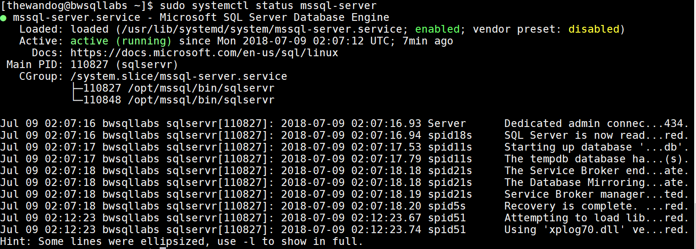

    SQL Server is installed as a systemd unit which is like a service on Windows. **systemctl** is used to report on the status and control the service.

    Note in this output two PID values under Cgroup: in this output. We launch two processes for sqlservr on Linux. The top one is the parent which forks the child. The child process is the main SQL Server engine.

    You can also see the bottom of the ERRORLOG displayed when running this command

2. Run the following commands to test stopping, starting, and restarting SQL Server

    `sudo systemctl stop mssql-server`

    `sudo systemctl status mssql-server`

    `sudo systemctl start mssql-server`

    `sudo systemctl status mssql-server`

    `sudo systemctl restart mssql-server`

    `sudo systemctl status mssql-server`

    Note that there are no return values when starting, stopping, or restarting. You must run systemctl status to check on the status of SQL Server. With each start of SQL Server, you should see different PID values (for new processes).

3. Let's see where everything is installed. Run the following command to see where the binaries are installed

    `sudo ls -l /opt/mssql/bin`

    This directory contains the sqlservr executable, mssql-conf script, and other files to support crash dumps. There is no method today to change the location of these files.

4. Run these commands to see where the default directories for databases and ERRORLOG log (and other log files) are stored

    `sudo ls -l /var/opt/mssql/data`

    `sudo ls -l /var/opt/mssql/log`

    Note from the results that the owner of these files is mssql and mssql. This is a group and non-interactive user called mssql which is the context under which sqlservr executes. Any time sqlservr needs to read or write a file, that file or directory must have mssql:mssql permissions. There is no method to change this today. You can change the default locations of database files, backups, transaction log files, and the ERRORLOG directory using the mssql-conf script.

5. Let's dump out the current ERRORLOG file using a command on Linux called **cat** (and another variation using **more** so you can page the results)

    `sudo cat /var/opt/mssql/log/errorlog`

    `sudo more /var/opt/mssql/log/errorlog`

### Learn common Linux commands

Let's learn a few common Linux commands while interacting with the bash shell

1. Find out information about the computer running Linux by running the following command

    `sudo dmidecode -t 1`

    On Azure Virtual Machine, the output should look like the following

    

2. Find out information about the Linux distribution by running the following command

    `cat /etc/*-release`

3. Find out information about memory configured on the Linux Server by running the following command

    `cat /proc/meminfo`

    The **MemTotal** is the total amount of physical memory on the Linux Server

    The /proc directory is known as the *proc filesystem* and there is other interesting information exposed in files in this directory.

4. Find out about the number of cores, sockets, NUMA nodes, and chip architecture by running the following command

    `lscpu`

5. The **ps** command is used to view all processes on the Linux Server. Use this command to scroll through all processes including parent/child process relationships

    `ps axjf | more`

6. Run the following command to see a list of disks and mounted file systems on these disks including disk sizes

    `df -H`

    On my Azure Virtual Machine, the output looks like the following

    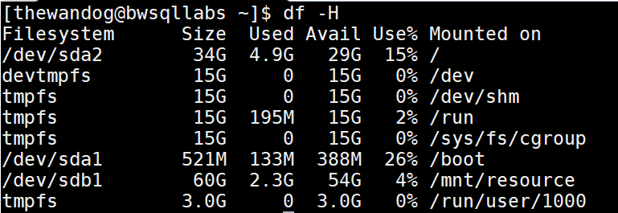

    The disk starting with /dev are the true disks for the server.

7. To see basic performance information by process run the following command

    `top`

    **top** will sort the results with the process using the most CPU at the top which since nothing else is running is sqlservr

    

    The **KiB Mem** values show physical total, free, and used memory.  
    The **RES** column is the amount of physical memory used by a process like sqlservr.  

    **top** is interactive so type in "q" to quit the program 

8. **iotop** is a utility to monitor I/O statistics per process. However, it is not installed by default. Run the following command to first install iotop

    `sudo yum install -y iotop`

    Now run the following command to execute iotop

    `sudo iotop`

    This shows the overall I/O on the system plus I/O per process. Type in "q" to exit the program. Run this version of the command to only view I/O for processes actually using I/O. This program is interactive and refreshes itself every few seconds

    `sudo iotop -o`

    There are many other options with iotop. Execute the command `man iotop` to experiment with all iotop options.

9. **htop** is an interactive program to see process utilization information across processors and processes. However, it is not installed by default so run the following commands first to install htop.

    `sudo wget dl.fedoraproject.org/pub/epel/7/x86_64/Packages/e/epel-release-7-11.noarch.rpm`

    `sudo rpm -ihv epel-release-7-11.noarch.rpm`

    `sudo yum install -y htop`

    Now run the interactive htop command to observe its display

    `htop`

    Here is what htop looks like on my Azure Virtual Machine

    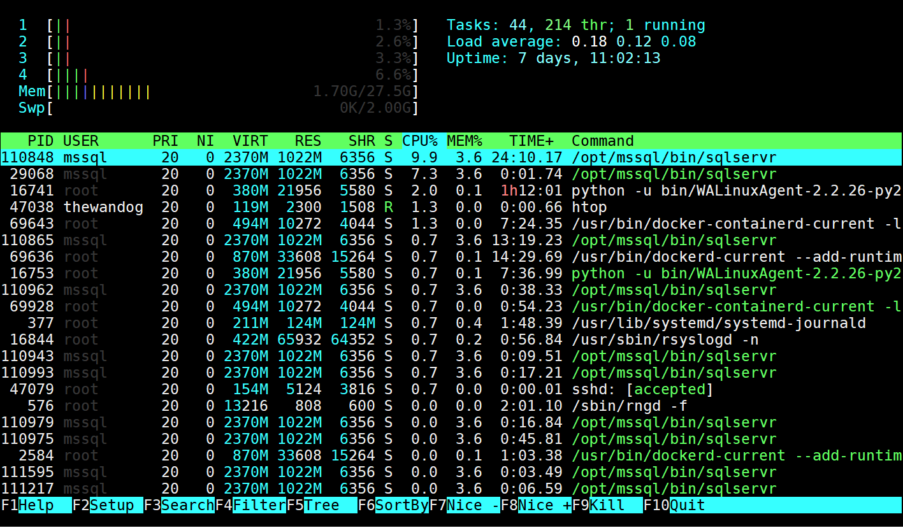

    Type "q" to exit the tool

10. You will likely need a good editor while using Linux. While the editor vi is installed by default, I recommend you use the **nano** editor. It may be already installed but if not run the following command to install it

    `sudo yum install -y nano`

    Let's use nano to create a shell script to run on Linux

    `nano dumperrorlog.sh`

    nano is a full screen editor. Type in the following in the editor window

    `sudo cat /var/opt/mssql/log/errorlog`

    Type Ctrl+X to exit. You will get prompted to save the file

    Run the following command to make the script executable

    `chmod u+x dumperrorlog.sh`

    Now execute the script

    `./dumperrorlog.sh`

### Install SQL Server command line tools on Linux

SQL Server on Linux supports both natively compiled command line tools like **sqlcmd** and open source, cross-platform command line tools such as **mssql-cli**. In this section you will go through the process of installing these tools and performing a quick test to confirm they work. Run all of the following commands from your ssh session with the bash shell. This lab assumes your Linux Server is connected to the internet, but there are pointers in each section for an offline install.

#### Install sqlcmd on Linux

Let's install the SQL command line tools including sqlcmd (Note: you can also install the tools offline per the following documentation <https://docs.microsoft.com/sql/linux/sql-server-linux-setup-tools#offline-installation)>)

1. Change to superuser mode by running the following command

    `sudo su`

2. Run the following command to download the repository configuration file for tools

    `curl https://packages.microsoft.com/config/rhel/7/prod.repo > /etc/yum.repos.d/msprod.repo`

3. Exit superuser mode

    `exit`

4. Install the ODBC driver and sql command line tools packages

    `sudo yum install mssql-tools unixODBC-devel`

5. Make sqlcmd accessible in your PATH by executing the following commands

    `echo 'export PATH="$PATH:/opt/mssql-tools/bin"' >> ~/.bash_profile`

    `source ~/.bash_profile`

6. Run a quick test to connect with sqlcmd by executing the following

    `sqlcmd -Usa -Slocalhost`

    Put in your sa password. At the sqlcmd prompt, run the following T-SQL statement

    ```sql
    SELECT @@VERSION
    GO
    ```

    You should get results similar to the following (Your version could vary depending on the latest Cumulative Update available)

    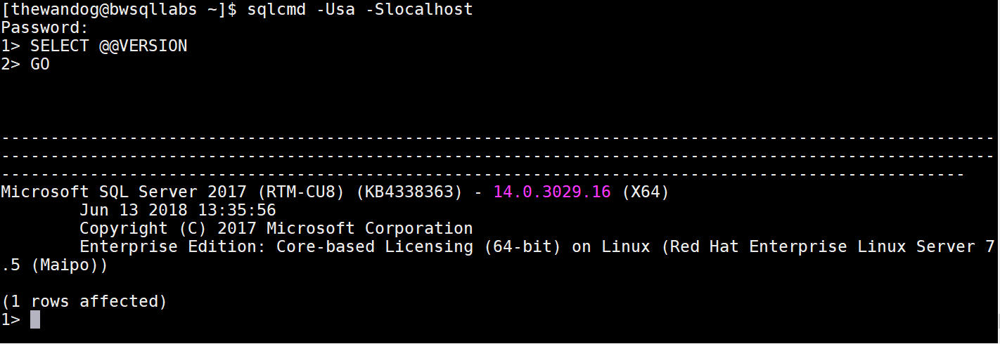

    Type in "exit" to quit sqlcmd

#### Install mssql-cli on Linux

You will perform the same tasks to install the new open source, cross-platform tool **mssql-cli**, which is built on python. This tool is in preview as of July 2018. To perform the installation offline, check the documentation at <https://github.com/dbcli/mssql-cli/blob/master/doc/installation/linux.md#red-hat-enterprise-linux-rhel-7>

1. Import a repository key by running the following command

    `sudo rpm --import https://packages.microsoft.com/keys/microsoft.asc`

2. Pull down the repository file for mssql-cli by running the following command

    `curl https://packages.microsoft.com/config/rhel/7/prod.repo | sudo tee /etc/yum.repos.d/microsoft.repo`

3. Install the package using yum with the following command

    `sudo yum install -y mssql-cli`

4. Now test mssql-cli like we did for sqlcmd by running the following command

    `mssql-cli -Usa -Slocalhost`

5. You should get a new prompt like sqlcmd. At this prompt type in the following T-SQL command and hit Enter

    ```sql
    SELECT @@VERSION
    ```

    Notice as you started typing you see Intellisense functionality kick-in which is one of the differences from sqlcmd.

    Your results should look like the following (again your version may be different depending on which Cumulative Update version was available when you installed SQL Server)

    

    If you are not put back into the mssql-cli prompt, type "q" to get back to the prompt.

    mssql-cli does not recognize the "GO" keyword as sqlcmd does. Use a ";" to separate batches. You can also hit F3 to type statements in multiple lines but they will all be in one batch.

    Type in "exit" to quit mssql-cli

### Restore a database

Now you will learn the great compatibility story of SQL Server on Linux by restoring a backup from SQL Server on Windows to SQL Server on Linux. And you will interact with this database using sqlcmd and mssql-cli. This section of the lab assumes your Linux Server is connected to the internet. If you are not connected to the internet, you can download the database to restore from <https://github.com/Microsoft/sql-server-samples/releases/download/wide-world-importers-v1.0/WideWorldImporters-Full.bak> and then copy it to your Linux Server (MobaXterm drag and drop is really nice for this)

1. From your Linux ssh session, run the following command from the bash shell

     `wget https://github.com/Microsoft/sql-server-samples/releases/download/wide-world-importers-v1.0/WideWorldImporters-Full.bak`

    Depending on your network speed this should take no more than a few minutes

2. Copy and restore the WideWorldImporters database. Copy the **cpwwi.sh**, **restorewwi.sh**, and **restorewwi_linux.sql** files from the downloaded zip of the gitHub repo into your home directory on Linux. MobaXterm provides drag and drop capabilities to do this. Copy these files and drop them into the "explorer" pane in MobaXterm on the left hand side from your ssh session.

    Note: You can skip this step if you have already cloned the git repo in the prelab. If you have done this, the scripts in this lab are in the **sqllinuxlab** subdirectory. You can copy them into your home directory or edit them to ensure you have the right path for the WideWorldImporters backup file.

3. Run the following commands from the bash shell to make the scripts executable (supply the root password if prompted)

    `sudo chmod u+x cpwwi.sh`

    `sudo chmod u+x restorewwi.sh`

4. Copy the backup file to the SQL Server directory so it can access the file and change permissions on the backup file by executing the following command in the bash shell

    `./cpwwi.sh`

5. Now restore the database by executing the following command from the bash shell

    `./restorewwi.sh`

6. When this command completes successfully the output in your ssh session should look like the following

    

7. Connect with sa to run a query against this database. Run sqlcmd first to connect. Type in the sa password when prompted

    `sqlcmd -Usa -Slocalhost`

8. From the sqlcmd prompt run these commands

    ```sql
    USE WideWorldImporters
    GO
    SELECT * FROM [Sales].[Customers]
    GO
    ```

    The results flash by so it is difficult to see the rows from this table like the following

    

    Type in "exit" to quit sqlcmd

9. Now run the same set of commands using mssql-cli. Connect to SQL Server with mssql-cli. Type in the sa password when prompted

    `mssql-cli -Usa -Slocalhost`

10. Run the following T-SQL commands from the msql-cli prompt (BONUS: Use Intellisense to complete these queries)

    `USE WideWorldImporters;SELECT * FROM Sales.Customers;`

    See how mssql-cli by default will present rows in a vertical record format. Hit Enter or Space to keep paging as many rows as you like. Your results should look like the following

    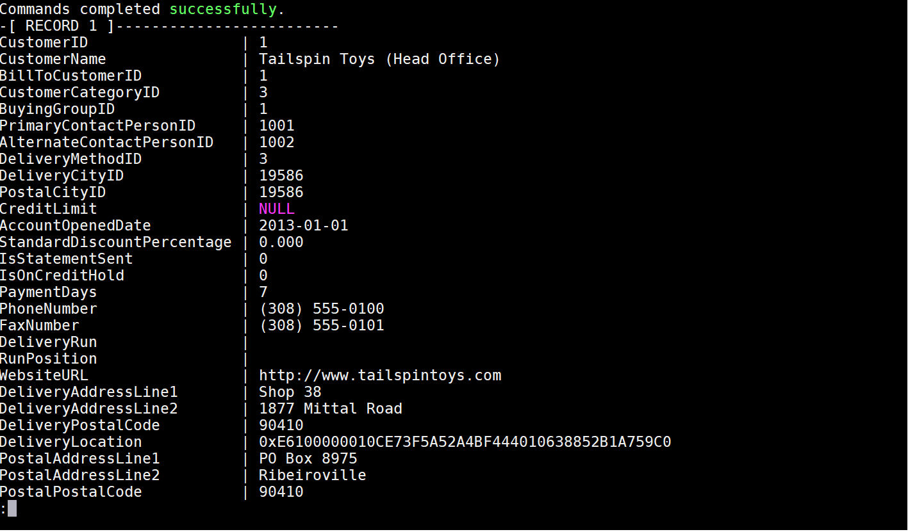

    Type in "q" at any time to get back to the prompt and "exit" to quit mssql-cli

### Use mssql-conf to set a traceflag

There may be situations where you need to enable a traceflag as global and at SQL Server startup time. For Windows, this is done through the SQL Server Configuration Manager. For SQL Server on Linux, you will use the mssql-conf script. A list of all documented traceflags can be found at <https://docs.microsoft.com/sql/t-sql/database-console-commands/dbcc-traceon-trace-flags-transact-sql>.

Let's say you wanted to enable trace flag 1222 for deadlock details to be reported in the ERRORLOG.

1. Run the following command from an ssh session with the bash shell

    `sudo /opt/mssql/bin/mssql-conf traceflag 1222 on`

    When this succeeds you will get a message that SQL Server needs to be restarted like the following

    

2. Per these instructions, restart SQL Server with the following command:

    `sudo systemctl restart mssql-server`

    Note: If this is successful, the command just returns to the shell prompt

3. Verify the trace flag was properly set by looking at the ERRORLOG with the following command

    `sudo more /var/opt/mssql/log/errorlog`

    The ERRORLOG should show -T 1222 as a startup parameter like the following

    

4. BONUS: Use sqlcmd or mssql-cli to verify this trace flag is set by running the following T-SQL statement

    ```sql
    DBCC TRACESTATUS(-1)
    ```

    The results should show that trace flag 1222 is setup globally like the following

    

### Existing familar tools like SQL Server Management Studio (SSMS) just work!

In this lab, if you are using a Windows client, see how SQL Server Management Studio (SSMS) works "as is" against a SQL Server on Linux.

1. Connect with SQL Server Management Studio using SQL Authentication with the sa account and the server name for your Linux Server. If the server is running on Azure Virtual Machine use the full DNS name from the portal like bwsqllabs.westus.cloudapp.azure.com

2. Use Object Explorer and the Query Editor just like you would a normal SQL Server instance. Go through some of the steps in the SSMS tutorial in our documentation at <https://docs.microsoft.com/sql/ssms/tutorials/tutorial-sql-server-management-studio>

## Automatic Tuning and SQL Tooling Lab for SQL Server on Linux

**STOP: This lab requires you have already followed the instructions in the prelab**

This self-paced lab demonstrates the Automatic Tuning (Auto Plan Correction) feature of SQL Server on Linux. As part of this lab you will learn fundamentals of using SQL Operations Studio, which you should have installed as part of the prelab.

Automatic Tuning in SQL Server is a feature that uses the rich telemetry of Query Store to detect query plan regression issues. By default, if the Query Store is enabled for a database, SQL Server can detect query plan regression problems and provide recommendations through a Dynamic Management View. In addition, if the Automatic Tuning feature is enabled for a database, SQL Server can detect the query plan regression and correct it automatically by reverting to a previous "known good" plan.

You can watch a demonstration of this lab on YouTube at <https://www.youtube.com/watch?v=Sh8W7IFX390>

### Lab Setup

We will use the WideWorldImporters full sample database for this lab. If you have already restored this in the deploy_and_explore lab you can skip the Lab Setup section. **This lab assumes you have already installed SQL Server for Linux on RHEL (requires Developer or Enterprise Edition) and SQL Server command line tools**.

1. Connect with ssh to your Linux Server and run the following command to copy this database to your Linux Server

    `wget https://github.com/Microsoft/sql-server-samples/releases/download/wide-world-importers-v1.0/WideWorldImporters-Full.bak`

2. Depending on your network speed this should take no more than a few minutes

3. Copy and restore the WideWorldImporters database. Copy the **cpwwi.sh**, **restorewwi.sh**, and **restorewwi_linux.sql** files from the downloaded zip of the gitHub repo into your home directory on Linux. MobaXterm provides drag and drop capabilities to do this. Copy these files and drop them into the "explorer" pane in MobaXterm on the left hand side from your ssh session.

     Note: You can skip this step if you have already cloned the git repo in the prelab. If you have done this, the scripts in this lab are in the **sqllinuxlab** subdirectory. You can copy them into your home directory or edit them to ensure you have the right path for the WideWorldImporters backup file.

4. Run the following commands from the bash shell to make the bash shell scripts executable (supply the root password if prompted)

    `sudo chmod u+x cpwwi.sh`

    `sudo chmod u+x restorewwi.sh`

5. Copy the backup file to the SQL Server directory so it can access the file and change permissions on the backup file by executing the following command in the bash shell

    `./cpwwi.sh`

6. Now restore the database by executing the following command from the bash shell

    `./restorewwi.sh`

7. When this command completes successfully the output in your ssh session should look like the following

    

### Query Plan Regression Recommendations

Here is the scenario this lab is trying to demonstrate. When you execute a stored procedure in SQL Server, the engine can use a technique called parameter sniffing to compile a query plan based on parameter values of the stored procedure. If the value of the parameter from the procedure is used in a query comparing to a column that has skewed values, the query plan chosen when the query is compiled may not be optimal. 

This can result in a situation where the initial query plan is fine based on a value that is not skewed, but then an unexpected event could cause the plan to be evicted from cache (Ex. memory pressure) and a new plan could be compiled based on a parameter value that is skewed. And it is possible this new plan may not perform well for all users. If this problem occurs, it is considered a query plan regression. This is because a new query plan for the same query yields in poor performance vs previous version of the query plan.

For this lab, we will create a new stored procedure that will accept an integer parameter value and query tables in the WideWorldImporters database that may result in a query plan regression problem. For this section of the lab, we will execute T-SQL scripts in SQL Operations Studio

1. Use SQL Operations Studio to open up the file **setup.sql**. Use the File menu of SQL Operations Studio to select Open File... and find the setup.sql on your local drive where you have copied or cloned these labs.

2. Click on the Run button as seen from the screenshot below

    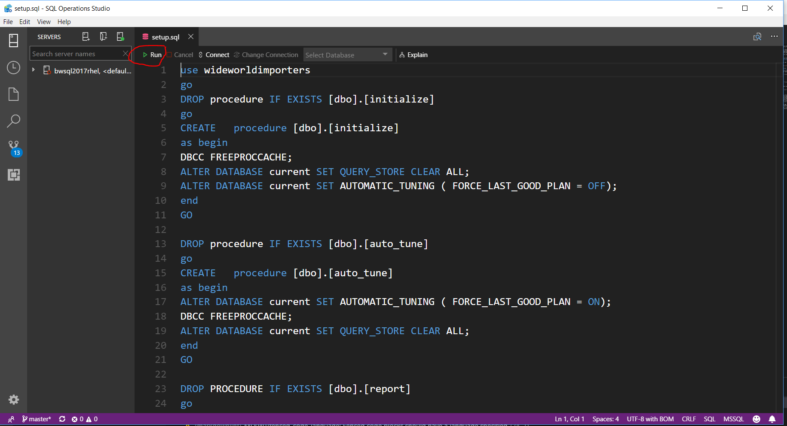

3. You will be prompted with a connection screen to put in information about the Linux Server. Fill in the name of the Linux Server you have created for these labs. For Azure put in the complete hostname as you used for ssh connection (without the username). For example, bwsqllabs.westus.cloudapp.azure.com. Supply the sa login and password and check the Remember password option. This script creates a stored procedure called report and other procedures used to help automate pieces of the lab. You will use the same process to open up and execute remaining T-SQL scripts. And each tine you connect you can use a previous connect from Recent History.Once you have executed a script and select Remember Password, you will not have to reconnect.

    Examine the contents of setup.sql to see what these procedures do. Note that Query Store was enabled before the WideWorldImporters database sample was backed up. Close out this script when you are done.

4. Execute the T-SQL script **initialize.sql** to clear the query store. Once you execute this script, close out the window.

5. Open up the T-SQL script **batchrequests_perf_collector.sql** and examine it. In order to observe workload performance we need to monitor Batch Requests/Sec. But Windows Performance Monitor does not work with SQL Server on Linux. Therefore this script will collect Batch Requests/Sec from the DMV dm_os_performance_counters in a loop storing them in a global temporary table. This will effectively be our "perfmon" to query and find out workload throughput. Hold off executing this script.

6. Open up the script **batchrequests.sql**. This script will query the global temporary table. When we execute the script, we will be able to use the built-in charting capabilities of SQL Operations Studio to view the workload throughput in a chart (kind of like a static perfmon chart). Notice the results are produced in a format of counter, time, value. Hold off executing this script.

7. Open up the script **report.sql**. This script is the workload simulator running the report procedure in a loop of batches. Hold off executing this script.

8. Now run the T-SQL in the script batchrequests_perf_collector.sql and report.sql. Wait for about 20 seconds for these to execute before going to the next step.

9. Now execute the T-SQL in the script batchrequests.sql. Select the icon to the right to view as chart after the results are displayed (Note: Your numbers may look slightly different)

    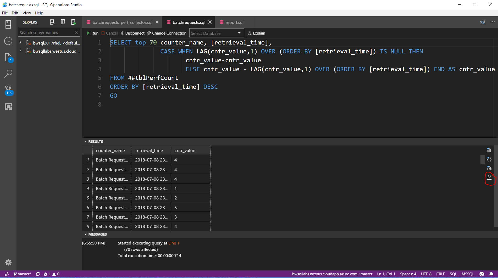

10. Select Chart Type and pick timeSeries. Your chart should show the throughput for Batch Requests/Sec. The numbers will vary but it should look something like the following (Notice the fairly consistent throughput from middle to right of the chart)

    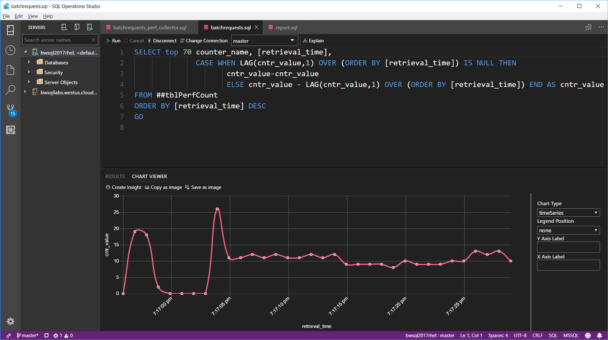

11. Now open up the script **regression.sql** and execute the T-SQL. This will run the regression procedure will will simulate a query plan regression problem. It will free the plan cache and then run the report procedure with a different parameter value. Note: The report.sql batch is running in a tight loop so you may have to run this 2-3 times to see the regression.

12. Run the script batchrequests.sql again and observe the chart. You should see a drop in performance like the following

    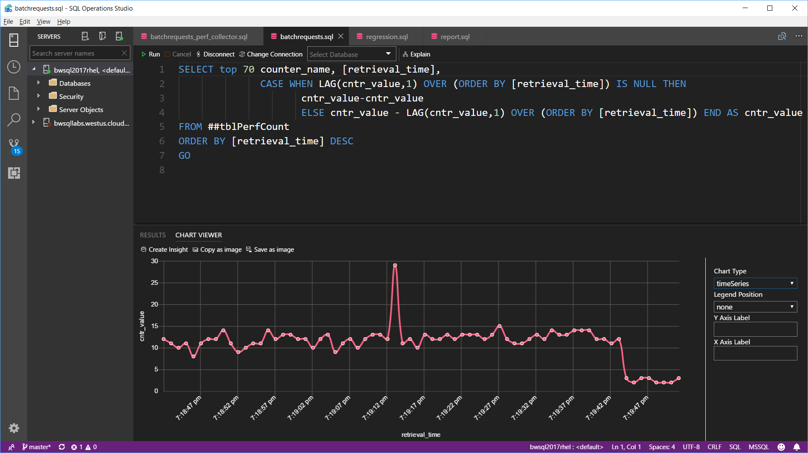

13. Open up the script **recommendations.sql** and execute it. The results show a query plan regression has been detected. Note the values of columns

    The **reason** column shows the avg CPU increased by 4x for the same query with a new query plan. We choose CPU since overall duration could vary based on an event that is not a true plan regression (Ex. blocking or slow I/O)

    The **state_transition_reason** column shows that Automatic Tuning is not enabled.

    The **script** column shows a T-SQL statement you can run to resolve the issue by reverting to a previous plan where performance was good. 

    

14. Hit Cancel in the windows for batchrequests_perf_collector.sql and report.sql to stop these batches. **Note: We are chasing down an obscure bug with SQL Operations Studio where in some cases these queries cannot be cancelled after running for a certain period of time. If this occurs, exit and restart SQL Operations Studio to go to the next steps in the lab.**

You now have observed how with Query Store enabled SQL Server can detect and recommend query plan regression problems. You also have recommendations on how to resolve the problem yourself manually.

### Automatic Tuning in Action

In this section of the lab, we will see the same type of query plan regression behavior as before except this time with Automatic Tuning enabled, SQL Server will automatically resolve the problem.

**Note: Do not run setup.sql or initialize.sql again for this part of the lab.**

1. Open up and execute the script **auto_tune.sql**. This is like initialize.sql except it enables automatic tuning. Close out this script

2. All the other scripts should still be open in SQL Operation Studio. You will go through the same steps as you did above starting with **step 8** in the previous section. Except, after running regression.sql, wait for a few seconds before running batchrequests.sql to see how SQL Server will automatically resolve the regression. In fact, the performance of the workload may go up slightly since the plan is being forced (not a guarantee in all cases).

3. If SQL Server has corrected the problem, the chart from batchrequests.sql should look something like this

    

4. Run recommendations.sql again and see the results. They should be similar except the state_transition_reason now says LastGoodPlanForced indicating SQL Server has automatically corrected the query plan regression problem

    

You have seen that by default if Query Store is enabled, SQL Server can pinpoint and recommend query plan regression performance problems. Then, if you are comfortable, you can enable automatic tuning and let SQL Server correct these types of problems automatically.

## SQL Server Containers Lab

### Pre Lab
1. Install docker engine by running the following:
```
sudo yum install -y yum-utils device-mapper-persistent-data lvm2

sudo yum-config-manager --add-repo https://download.docker.com/linux/centos/docker-ce.repo

sudo yum install http://mirror.centos.org/centos/7/extras/x86_64/Packages/pigz-2.3.3-1.el7.centos.x86_64.rpm

sudo yum install docker-ce
 ```

check status of docker engine:
```
sudo systemctl status docker
 ```

if is not running, start it by running:
``` 
sudo systemctl start docker
```
>Note: for this lab, we are installing docker for CentOS, this will work on CentOS or RHEL due to the similarity of the OS’s. For production usage on RHEL, install Docker EE for RHEL: https://docs.docker.com/install/linux/docker-ee/rhel/.
 
2. clone this repo by running the following:

    Note: If you have already done this in the prelab you can skip this step

```
sudo yum install git
git clone https://github.com/Microsoft/sqllinuxlabs.git
```
---

### Lab
#### 1. Getting started with SQL Server in Containers

##### Introduction
In this section you will run SQL Server in a container and connect to it with SSMS/SQL Operations Studio. This is the easiest way to get started with SQL Server in containers.  
 
##### Steps
1. Change the `SA_PASSWORD` in the command below and run it in your terminal:
``` 
sudo docker run -e 'ACCEPT_EULA=Y' -e 'SA_PASSWORD=YourStrong!Passw0rd' \
      -p 1500:1433 --name sql1 \
      -d microsoft/mssql-server-linux:2017-latest
 ```

> Tip: edit commands in a text editor prior to pasting in the terminal to easily edit the commands.
>
> Note: By default, the password must be at least 8 characters long and contain characters from three of the following four sets: Uppercase letters, Lowercase letters, Base 10 digits, and Symbols.

 
2. Check that SQL Server is running:
```
sudo docker ps
```


3. Connect to SQL Server in container using SSMS or SQL Ops Studio.

Open SSMS or Ops studio and connect to the SQL Server in container instance by connecting host:

```
<host IP>, 1500
```
>Note: If you are running this in an Azure VM, the host IP is the public Azure VM IP. You will also need to open port 1500 external traffic. [go here to learn how to open ports in Azure VMs](/open_azure_vm_port)


3. Run SQLCMD inside the container. First run bash interactively in the container with docker execute 'bash' inside 'sql1' container. 

```
sudo docker exec -it sql1 bash
```
Use SQLCMD within the container to connect to SQL Server:
```
/opt/mssql-tools/bin/sqlcmd -U SA -P 'YourStrong!Passw0rd'
```


Exit SQLCMD and the container with exit:
```
exit
```

> **Key Takeaway**
> 
>SQL Server running in a container is the same SQL Server engine as it is on Linux OS or Windows.
 
---

#### 2. Explore Docker Basics
##### Introduction
 In this section you'll learn the basics of how to navigate container images and active containers on your host.

##### Steps
Enter the following commands in your terminal.

See the active container instances:
```
sudo docker ps
```
List all container images:
```
sudo docker image ls
```
Stop the SQL Server container:
```
sudo docker stop sql1
```
See that `sql1` is no longer running by listing all containers: 
```
sudo docker ps -a
```
Delete the container:
```
sudo docker rm sql1
```
See that the container no longer exists:
```
sudo docker container ls
```


> **Key Takeaway**
>
> A container is launched by running an image. An **image** is an executable package that includes everything needed to run an application--the code, a runtime, libraries, environment variables, and configuration files.
>
>A **container** is a runtime instance of an image--what the image becomes in memory when executed (that is, an image with state, or a user process). You can see a list of your running containers with the command, docker ps, just as you would in Linux.
> 
> -- https://docs.docker.com/get-started/
 
---

#### 3.  Build your own container 

##### Introduction:
In the past, if you were to set up a new SQL Server environment or dev test, your first order of business was to install a SQL Server onto your machine. But, that creates a situation where the environment on your machine might not match test/production.

With Docker, you can get SQL Server as an image, no installation necessary. Then, your build can include the base SQL Server image right alongside any additional environment needs, ensuring that your SQL Server instance, its dependencies, and the runtime, all travel together.

In this section you will build your a own container layered on top of the SQL Server image. 

Scenario: Let's say for testing purposes you want to start the container with the same state. We’ll copy a .bak file into the container which can be restored with T-SQL.  
 
##### Steps:

1. Change directory to the `mssql-custom-image-example folder`.
```
cd sqllinuxlabs/containers/mssql-custom-image-example/
```


2. Create a Dockerfile with the following contents
```
cat <<EOF>> Dockerfile
FROM microsoft/mssql-server-linux:latest
COPY ./SampleDB.bak /var/opt/mssql/data/SampleDB.bak
CMD ["/opt/mssql/bin/sqlservr"]
EOF
```

3. View the contents of the Dockerfile 

```
cat Dockerfile
```


4. Run the following to build your container
```
sudo docker build . -t mssql-with-backup-example
```


5. Start the container by running the following command after replacing `SA_PASSWORD` with your password
```
sudo docker run -e 'ACCEPT_EULA=Y' -e 'SA_PASSWORD=YourStrong!Passw0rd' \
      -p 1500:1433 --name sql2 \
      -d mssql-with-backup-example
```

6. Edit the `-P` with the value used for `SA_PASSWORD` used in the previous command and view the contents of the backup file built in the image:

```
   sudo docker exec -it sql2 /opt/mssql-tools/bin/sqlcmd -S localhost \
   -U SA -P 'YourStrong!Passw0rd' \
   -Q 'RESTORE FILELISTONLY FROM DISK = "/var/opt/mssql/data/SampleDB.bak"' \
   -W \
   | tr -s ' ' | cut -d ' ' -f 1-2
```

the output of this command should be similar to this:
>LogicalName PhysicalName
>----------- ------------
>ProductCatalog /var/opt/mssql/data/ProductCatalog.mdf
>ProductCatalog_log /var/opt/mssql/data/ProductCatalog_log.ldf

7. Edit the `-P` with the value of `SA_PASSWORD` used to start the container and restore the database in the container:
```
sudo docker exec -it sql2 /opt/mssql-tools/bin/sqlcmd \
   -S localhost -U SA -P YourStrong!Passw0rd \
   -Q 'RESTORE DATABASE ProductCatalog FROM DISK = "/var/opt/mssql/data/SampleDB.bak" WITH MOVE "ProductCatalog" TO "/var/opt/mssql/data/ProductCatalog.mdf", MOVE "ProductCatalog_log" TO "/var/opt/mssql/data/ProductCatalog.ldf"'

```
the output of this command should be similar to 

>Processed 384 pages for database 'ProductCatalog', file  'ProductCatalog' on file 1.
>
>Processed 8 pages for database 'ProductCatalog', file 'ProductCatalog_log' on file 1.
>
>RESTORE DATABASE successfully processed 392 pages in 0.278 seconds (11.016 MB/sec).

If you connect to the instance, you should see that the database was restored.
 


7. Clean up the container
```
sudo docker stop sql2
sudo docker container rm sql2
```


> **Key Takeaway**
>
> A **Dockerfile** defines what goes on in the environment inside your container. Access to resources like networking interfaces and disk drives is virtualized inside this environment, which is isolated from the rest of your system, so you need to map ports to the outside world, and be specific about what files you want to “copy in” to that environment. However, after doing that, you can expect that the build of your app defined in this Dockerfile behaves exactly the same wherever it runs.
>
> -- https://docs.docker.com/get-started/part2/#your-new-development-environment
---

 #### 4. Run a Containerized Application with SQL Server
 
 ##### Introduction
  
Most applications involve multiple containers. 

##### Steps

1. Install docker-compose:
```
sudo curl -L https://github.com/docker/compose/releases/download/1.21.2/docker-compose-$(uname -s)-$(uname -m) -o /usr/local/bin/docker-compose

sudo chmod +x /usr/local/bin/docker-compose

sudo ln -s /usr/local/bin/docker-compose /usr/bin/docker-compose
```


1. Change directory to the mssql-aspcore-example.

```
cd sqllinuxlabs/containers/mssql-aspcore-example 
```

>note: if you just finished the **Build your own container** lab, you can navigate to this folder with the following command:
>
> `cd ../../containers/mssql-aspcore-example `

2. Open the docker-compose.yml file 
```
nano docker-compose.yml
```

3. Edit the `SA_PASSWORD` SQL Server environment variables then save the file with `ctrl + x`


4. Edit the `-P` parameter in the `./mssql-aspcore-example-db/db-init.sh` file with the `SA_PASSWORD` that you used in the previous step 
```
nano ./mssql-aspcore-example-db/db-init.sh
```


4. Run the containers with docker-compose:
```
sudo docker-compose up
```
>note: this will take approx. 15 seconds


5. At this point, you will have two containers up and running: an application container that is able to query the database container. Connect to the 

```
http:<host IP>:5000
```
>Note: If you are running this in an Azure VM, the host IP is the Azure VM Public IP. You will also need to open port 5000 external traffic. [go here to learn how to open ports in Azure VMs](/open_azure_vm_port). Be sure to open up port 5000 based on this example.


To stop the docker compose application, press `ctrl + c` in the terminal. 
To remove the containers run the following command:

```
sudo docker-compose down
```


#### Start-up Explanation

1. Running `docker-compose up` builds/pulls containers and run them with parameters defined in docker-compose.yml
2. The .Net Core application container starts up  
3. The SQL Server container starts up with `entrypoint.sh`

    a. The sqlservr process starts 

    b. A start script is run to apply schema needed by application     

4. The .Net Core application is now able to connect to the SQL Server container with all necessary 


> **Key Takeaway**
>
> **Compose** is a tool for defining and running multi-container Docker applications. With Compose, you use a YAML file to configure your application’s services. Then, with a single command, you create and start all the services from your configuration.
>
> --https://docs.docker.com/compose/overview/