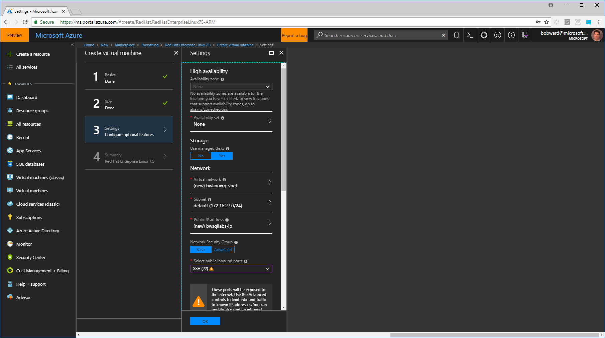
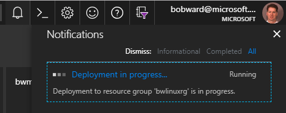
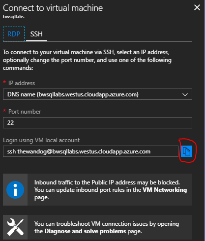
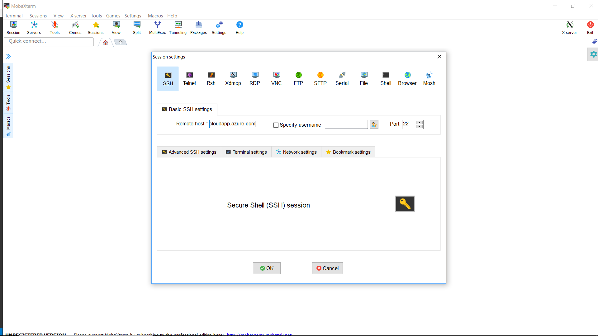
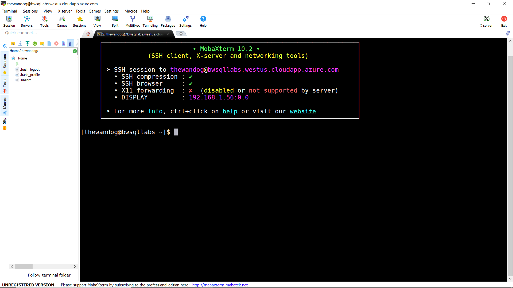

# Prelab setup for SQL Server on Linux Labs

This lab is required to setup your environment and tools to use the other labs. In order to complete the prelab, you will need the following:

- An Azure subscription
- A Windows, Linux, or MacOS Client computer. You can use another Azure VM running Windows or Linux as a client. Note: Currently the labs are only setup for Windows clients. It is possible to complete other labs with macOS and Linux clients provided you have a ssh program and install SQL Operations Studio. We will provide more complete instructions for MacOS and Linux clients at a future time.

The prelab is divided into four sections:

- Deploying an Azure Virtual Machine running Linux
- Installing tools on your client
- Connecting to the Linux VM with ssh
- Installing Updates and Docker for Linux

## Deploying an Azure Virtual Machine running Linux

For this first step in the prelab, you will learn how to deploy an Azure Virtual Machine running Red Hat Enterprise Linux. You will not install SQL Server during this prelab. You will do this in the first lab called **deploy_and_explore**.

1. Login into the Azure portal at <http://portal.azure.com>

2. Click on **+ Create a resource**

3. Type in "Red Hat Enterprise Linux" in the Search Window and hit Enter. Your results should look something like this

    

4. Select Red Hat Enterprise Linux 7.5 from the list

5. Click on the **Create** button at the bottom of the screen

6. Fill out the following fields on the Basic blade
    - Fill in the Name field with a unique hostname
    - Leave VM disk type to SSD
    - Type in a Username
    - Choose Authentication Type of Password
    - Type in and Confirm a password that meets requirements. **IMPORTANT: This password will be used to login to the Linux VM. It is all the root password which you will use with the sudo command in the labs. So secure and save this password.**
    - Leave AAD Disabled
    - Choose your Subscription
    - Type in a new Resource Group name or select an existing one you have already created
    - Choose a location for your VM
    - Click on OK

        

7. Choose a size for your VM
    - For purposes of these labs, we recommend a minimum of 4 vCPUs and 16GB RAM. I typically choose a DS13_V2 but you are free to pick any other VM with these minimum sizes (like a D8s_V3).
    - Click on **Select** when you have chosen your size

8. Fill out the following fields on the Settings blade
    - Leave Availability set to None
    - Leave Managed Disks to Yes
    - Leave all Network fields to default
    - Leave Network Security Group to Basic
    - Select SSH (22) and MS SQL (1433) for public inbound ports
    - Note: You are exposing your VM and SQL Server to a public port. To provide less exposure you can configure your VM after it is deployed to only allow specific IP addresses from your client computer to access the VM or SQL Server. Or if you choose to use an Azure VM as a client you do not have to choose this option provided you have setup your Azure VM as a client to access the Linux VM (such as placing the client Azure VM in the same virtual network)
    - Leave all other fields with default settings
    - Click OK

        

9. You will be presented with a new blade ready to create the VM. Click the **Create** button at the bottom of the blade

10. Your VM will now be deployed. You can click the Notifications icon at the top of the portal screen to see the deployment in progress. The typical time to create a virtual machine in Azure for Red Hat is about 5-10 minutes.

    

11. On the successful deployment screen, I recommend you select **Pin to Dashboard**

    

12. Now click on **Go to Resource** button and select X in the corner of this Notifications screen to remove it.

    

13. Configure a DNS name to make it easier to connect
    - On the resource page, click on **Configure** under **DNS name**
    - Type in a DNS name label. I typically just use the hostname when I created the VM
    - Click the Save button at the top of the screen. This should only take a few seconds
    - Click on the X to remove that screen

    

14. Your resources page should now show the DNS name your created

15. Click on the **Connect** icon on the top of the resources page to capture how to connect to this VM with ssh

16. Under Login using VM local account click on the **Copy** icon to grab a connection syntax to connect to this VM with ssh. The information you need is everything after the word ssh. For example, for `ssh thewandog@bwsqllabs.westus.cloudapp.azure.com` you will just need `thewandog@bwsqllabs.westus.cloudapp.azure.com`. Save this information to the next section. I call this the **Linux Login**

    

## Installing tools on your client

### Windows Client

1. Install the MobaXterm client application from <https://mobaxterm.mobatek.net/download-home-edition.html>

    - Choose the Installer Edition which in your browser will download a file called MobaXterm_Installer_v10.7.zip to your Downloads folder
    - Extract all the files from the zip file
    - Run the MobaXterm_installer_10.7.msi to launch the installer
    - Accept all the defaults to complete the installation

    Note: You are free to use any ssh client you like in these labs. My preferred ssh client on Windows is MobaXterm but these labs are not dependent on the use of this tool.

2. Install SQL Operations Studio from <https://docs.microsoft.com/sql/sql-operations-studio/download>

    - Choose the Installer Download from Windows.
    - Your browser will download the .exe file which is about 74Mb to your Downloads folder
    - Please make sure you are running at minimum the June 2018 Preview version of SQL Server Operations Studio. If you select the Help/About menu in the tool, your version should look something like the following

        

3. Install the latest SQL Server Management Studio (SSMS) from <https://docs.microsoft.com/sql/ssms/download-sql-server-management-studio-ssms>
    - If you have never installed SSMS before, choose the option "Download SQL Server Management Studio 17.X"
    - Please make sure you are running at minimum version 17.7
    - You can check your version by selecting the Help/About menu in the tool. Here is the following screenshot for Version 17.7

        

## Connecting to your Linux VM with ssh

### Windows Client

You will need the **Linux Login** and the password you saved from the Azure VM Deployment section above in the prelab.

1. Launch the MobaXterm program
2. Click on the Session icon in the upper left hand portion of the application
3. Choose the SSH icon on the far left hand side of the new screen that appears
4. Put in the Remote Host field the **Linux Login** and click OK. The following screenshot shows an example

    

5. When prompted type in the password you used when deploying the Azure VM
6. You may get prompted to save the password. I recommend you click Yes
7. When you have connected successfully, your screen should look like the following

    

## Installing Updates and Docker for Linux

Note: for this lab we are using the existing docker package in the RHEL yum repository. For customers using Docker with RHEL they should follow all the instructions at <https://docs.docker.com/install/linux/docker-ee/rhel/>

1. From your ssh prompt, update all existing packages and application by running this command (enter the password you used to connect with ssh when prompted). This could take several minutes to update.

    `sudo yum -y update`

2. Now install docker on RHEL with the following command:

    `sudo yum -y install docker`

You are now ready to go through the first self-paced lab called **deploy_and_explore**.

You will run the rest of the instructions on using Docker containers for SQL Server in the **containers** lab.